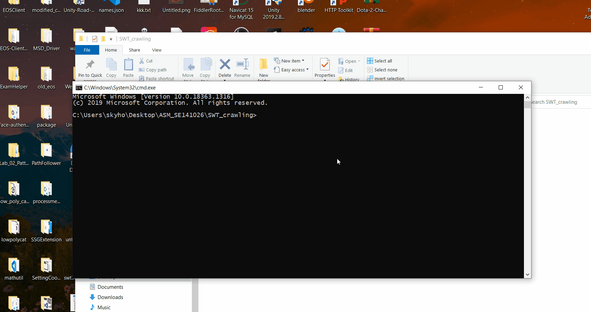
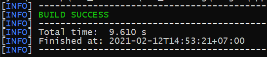
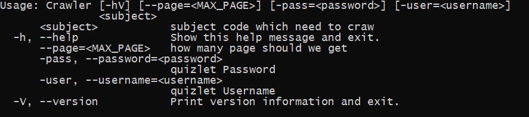
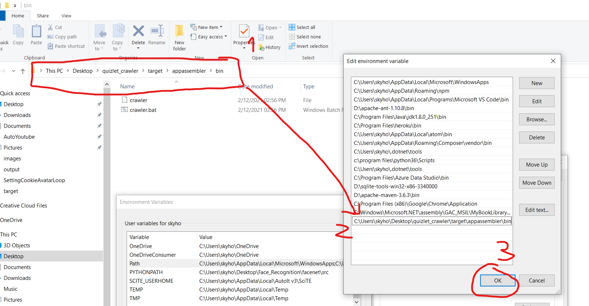
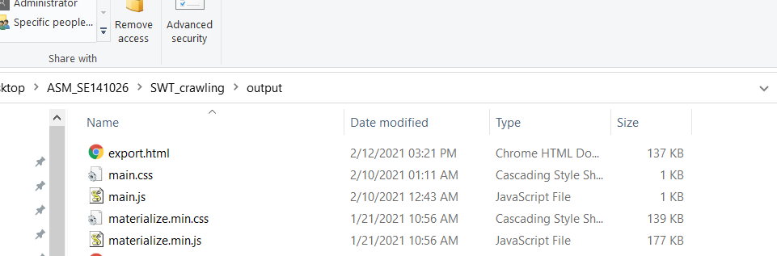

# Quizlet keys crawler
[](https://ci.appveyor.com/project/khangzxrr/quizlet-crawler)
## demonstration

## result


## Installation:

* Make sure you have installed JDK 1.8, JRE and [MAVEN](https://maven.apache.org/)

```bash
cd quizlet_crawler #Jump to project directory
mvn install appassembler:assemble #build using maven
```

* And this should happen: 

* Then cd to the build directory by following this command, and test if the build is OK:

```bash
cd target\appassembler\bin #Build directory
crawler -h #Help command
```

* And this should show up:


* now you can add the bin path to your PATH enviroment on window or ubuntu,... which help us easier to access the 'crawler' program, for example on window you can do this:


* And then 'crawler' command should work everywhere, then we back to the **root project directory** by command:

```bash
cd ../../../
```

* then try crawling quizlet now!:

```bash
crawler PRN292 #PRN292 is subject ID, replace your!
```

# How to export to HTML page:

* make sure you are in root of project! (folder must contain **swt301_bank.sqlite** which generated after running crawler command), then type:

```bash
crawler -e=exportkeys #replace exportkeys to whatever you want!
```

* and BAM, in the output folder you will see:



* It is working!, done
